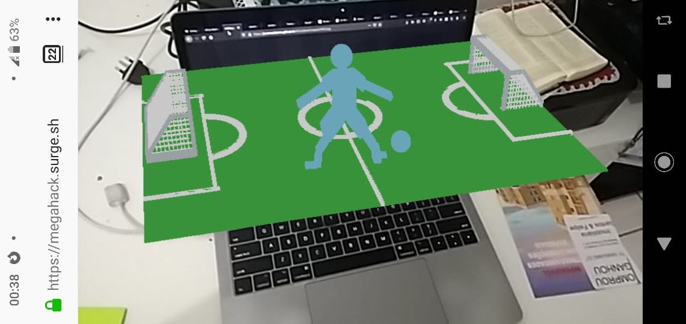

## Mega Hack - Desafio Globo

### Time: VR Play

Aqui está o repositorio onde utilizamos a biblioteca `AR.js` , responsável por gerar os modelos tridimensionais em Realidade aumentada, assim como você pode ver na imagem abaixo.

### Links uteis:

Gerador de QRCodes especificos:

https://jeromeetienne.github.io/AR.js/three.js/examples/marker-training/examples/generator.html

QRCode padrao

https://jeromeetienne.github.io/AR.js/data/images/HIRO.jpg

Editar modelos 3D online

https://www.tinkercad.com

AR.js

https://github.com/jeromeetienne/AR.js/blob/master/README.md

