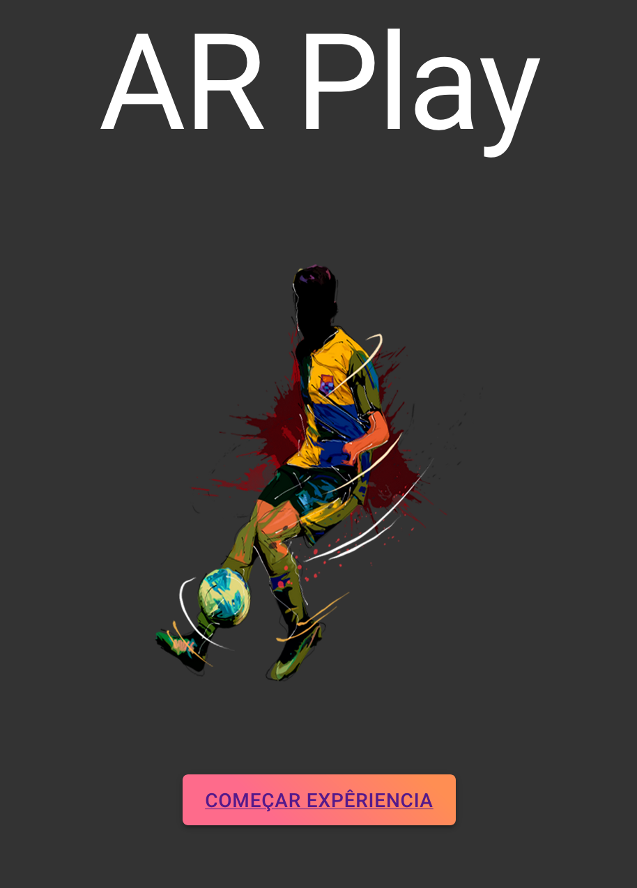
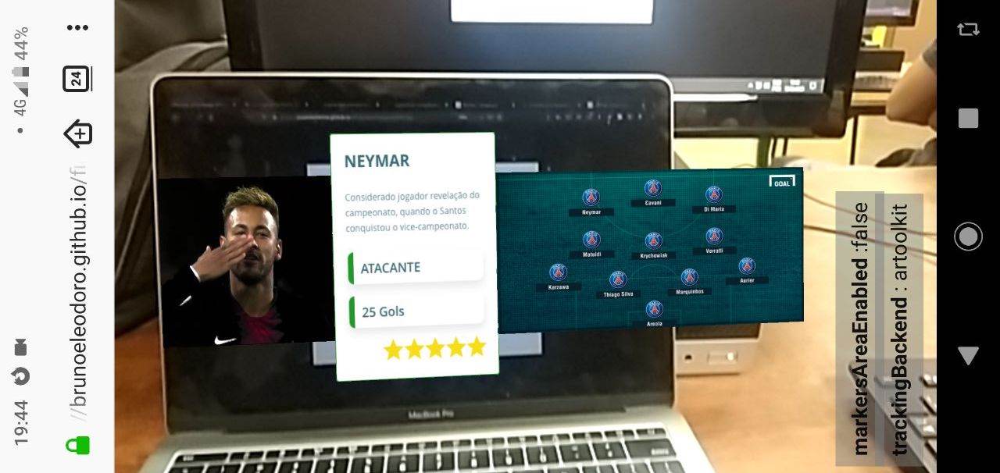

# Mega Hack - Desafio Globo

## Time: Code For Hope

## Projeto: VR Play

Aqui está o repositorio onde utilizamos a biblioteca `AR.js` , responsável por gerar os modelos tridimensionais em Realidade aumentada, assim como você pode ver na imagem abaixo.

## Como executar o projeto

Basta acessar a versão de deploy neste link:

https://brunoeleodoro.github.io/megahack/

Depois de acessar você vai ver uma tela como essa:

Após clicar no botão de início, você precisa autorizar o acesso do seu navegador á sua câmera.

Depois basta apontar a sua camera para o seguinte QRCode:

## Técnicamente falando... 

Utilizando o AR.js, temos a possibilidade de criar objetos de realidade aumentada em 3D ou 2D.

Na pasta root do projeto, temos um teste feito para mostrar um campo de futebol em 3D utilizando o QRCode.

Diretórios: 
  - custom_models: Onde fica o modelo 3D do campo de futebol.
  - data: Onde fica localizado o arquivo do QRCode que vai ser utilizado pela aplicação
  - docs: Apenas algumas imagens de testes.
  - pasta "js", "jsartoolkit5", "threex" : Ficam os scripts que são realmente quem fazer o trabalho de criar os modelos na tela do usuario
  - webapp: Onde fica o projeto do app em React, com o codigo que fica disponível para ser testado.
 
A pasta principal do projeto é 
https://github.com/BrunoEleodoro/megahack/tree/master/webapp

Para rodar ele, basta ir até o diretorio e executar o `npm start`, e depois realizar a leitura do QRCode para visualizar.

## Links uteis:

Gerador de QRCodes especificos:

https://jeromeetienne.github.io/AR.js/three.js/examples/marker-training/examples/generator.html

QRCode padrao

https://jeromeetienne.github.io/AR.js/data/images/HIRO.jpg

Editar modelos 3D online

https://www.tinkercad.com

AR.js

https://github.com/jeromeetienne/AR.js/blob/master/README.md

